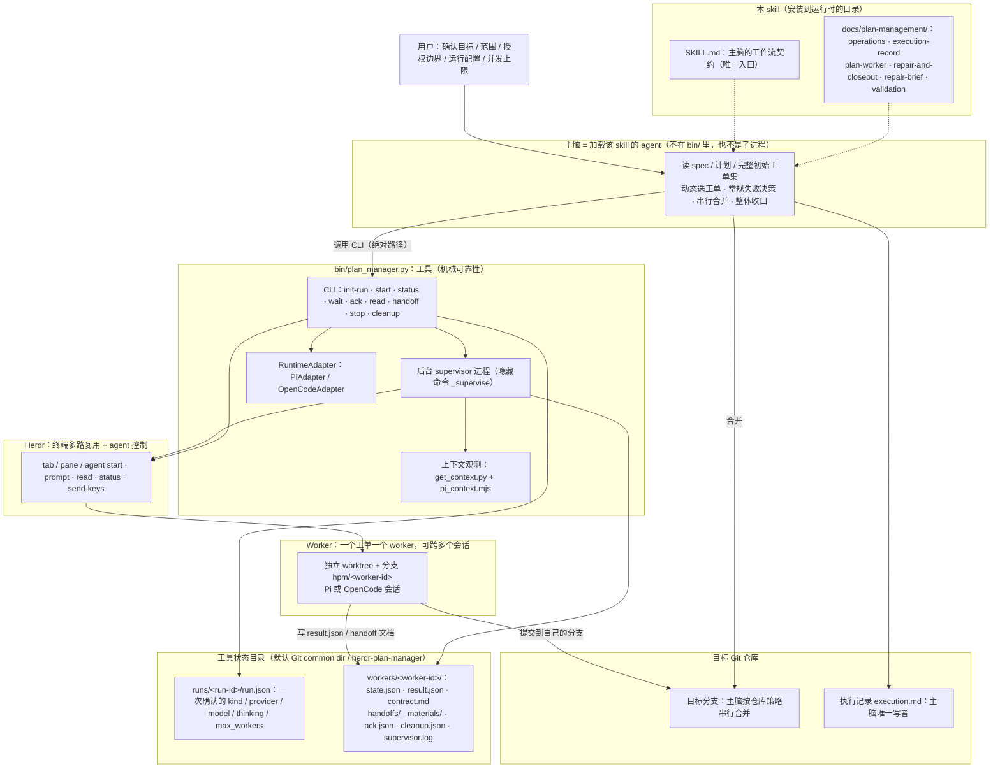
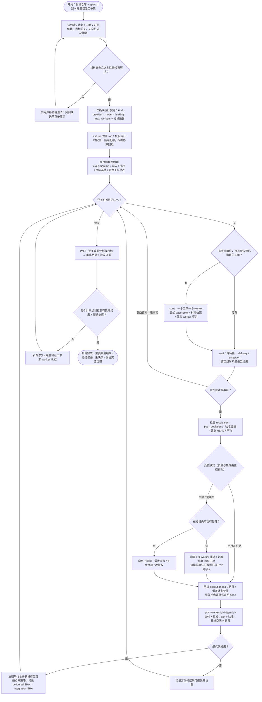
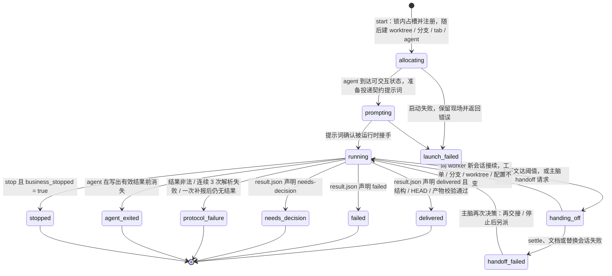
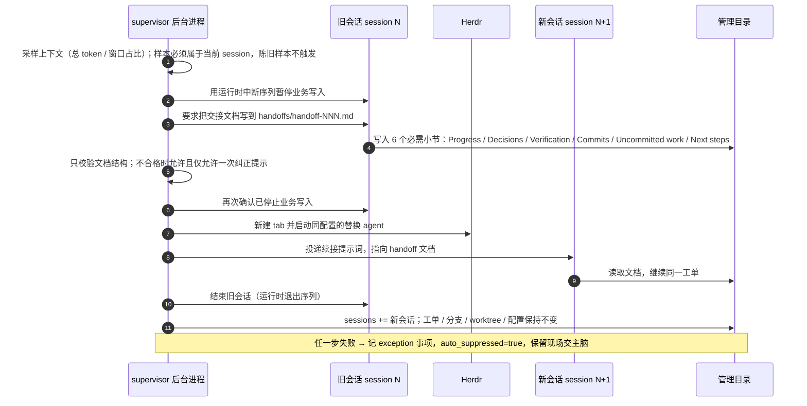
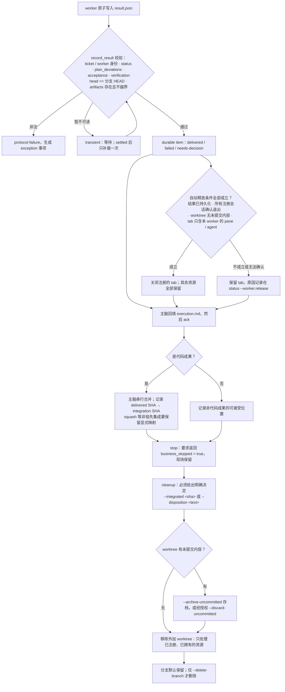

# herdr-plan-manager 架构与流程总览

> 本文是理解性文档（开发资产，已被 `.gitattributes` 的 `export-ignore` 排除在运行时分发包之外），不是运行时代理必须读取的 reference。
> 运行时代理只需要 `SKILL.md` + `docs/plan-management/` 中的文档。

一句话定位：**主脑负责判断，worker 负责具体工作，工具负责机械可靠性。**
`bin/plan_manager.py` 不排程、不选工单、不重试业务、不合并；它只把 Herdr 上的一次执行变成可观测、可交接、可保留、可清理的生活周期。

---

## 图 A：系统全貌（谁控制谁，谁写哪些事实）

要点：

- 主脑与工具是**两个进程层级**：主脑是交互 agent，工具是它调用的 CLI；后台 supervisor 是工具为每个 worker 拉起的进程。
- 事实分两处存放：**业务事实**（计划、工单状态、执行记录）在目标仓库；**工具状态**（run / worker / result / handoff）在管理目录，二者不互相复制。
- `init-run` 只注册不启动。`start` 一次只派一个工单，同一 run 内共享一份已确认配置与并发额度。

---

## 图 B：主脑主循环（这是项目的主流程图）

阅读要点：

- 循环**没有批屏障**：拿到任一事项就处理，不必等其他 worker。
- `ack` 可以发生在合并之前，但执行记录必须保留 `pending integration`；发布依赖代码工单时，必须在所需成果进入目标分支之后。
- 常规失败由主脑在授权内自行处理；只有需求取舍、扩大目标、改授权约束才回到用户。
- 修复、冲突解决、组合验证都是**新 worker 的新工单**，主脑只做判断和正常合并。

---

## 图 C：单个 worker 的生命周期（state.json 中的 `lifecycle.state`）

要点：

- `allocating` / `prompting` 仍占一个并发槽位；只有终态才释放槽位。
- `delivered` 后如果条件全部满足，supervisor 会自动关闭该 worker 的 tab（分支、worktree、结果、handoff、日志、材料全部保留）；任一条件不确定就保留 tab，并把原因写进 `status --worker` 的 `release` 字段。
- `handoff-failed` 会设置 `auto_suppressed`，不再自动交接，已完成的交接文档和现场都保留给主脑决策。

---

## 图 D：自动 worker 交接时序（上下文阈值触发）

要点：

- 自动交接由**工具**执行，无需主脑逐次批准；主脑只在失败、异常或想主动交接时介入（`handoff --reason`）。
- 工作成果通过**文档**交接给新会话，而不是恢复旧对话；这与 Herdr 的 live handoff / agent resume 是不同机制。
- 配置、分支、worktree 都不变，因此“同一工单仍在同一个 worker 名下”，只换会话。

---

## 图 E：交付 → 集成 → 清理（结果与资源如何处置）

---

## 关键不变量速查

| 说法 | 事实 |
| --- | --- |
| worker 交付了 | 只是 worker 的声明；结构校验通过不等于质量通过 |
| ack 了 | 只表示主脑处理过该事项；不改变交付或集成结论 |
| 终端 idle / done | 不是结果；settled 但无有效结果会走一次补报，再失败则 protocol-failure |
| wait 超时 | 只说明等待窗口内没有事项，对 worker 状态不作任何断言 |
| 已交付 | 不等于已集成；合并前后要在执行记录里分别留 SHA |
| worker 槽位释放 | 由生命周期终态决定；交接中的 worker 仍占一个槽位 |
| 自动关 tab | 不删分支、worktree、结果、handoff、日志、材料 |
| cleanup 删分支 | 默认不删；`--delete-branch` 才是显式决定，`--force-branch` 不是自动回退 |
| 旧执行记录 | 不迁移、不自动接管、不自动删除（第一版边界） |

## 谁在哪个文件里负责什么（给二次开发用）

| 关注点 | 位置 |
| --- | --- |
| 主脑工作流与职责边界 | `SKILL.md`、`CONTEXT.md` |
| 操作手册（命令、阈值、释放条件、清理决定） | `docs/plan-management/operations.md` |
| 执行记录模板（主脑唯一写者） | `docs/plan-management/execution-record.md` |
| worker 契约与 result.json 协议 | `docs/plan-management/plan-worker.md` |
| 冲突 / 行为修复与整体收口 | `docs/plan-management/repair-and-closeout.md`、`repair-brief.md` |
| 真实验收实验（A/B/C、修复、生命周期覆盖） | `docs/plan-management/validation.md` |
| CLI、supervisor、运行时适配、上下文阈值 | `bin/plan_manager.py`、`bin/get_context.py`、`bin/pi_context.mjs` |
| 确定性集成测试与运行时假件 | `tests/`（`export-ignore`，仅源码 checkout 可见） |
